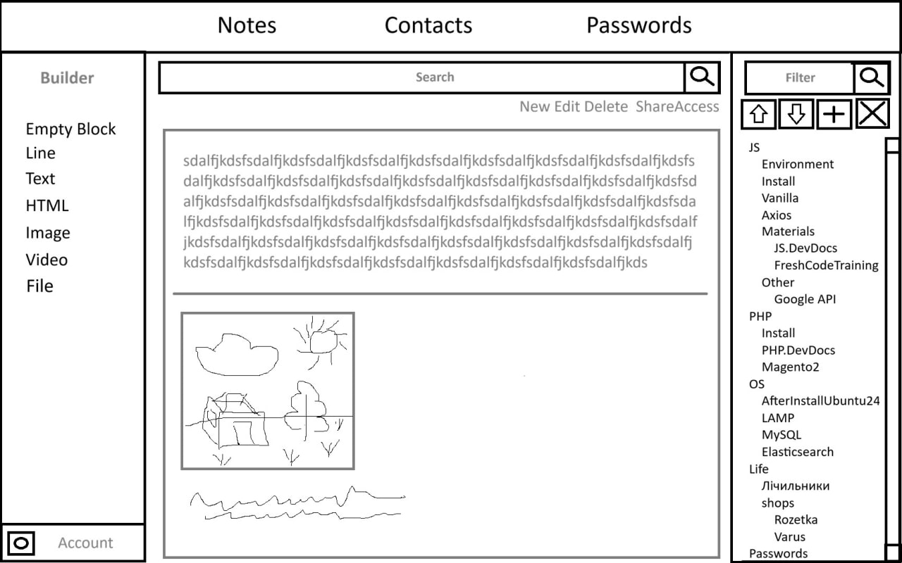
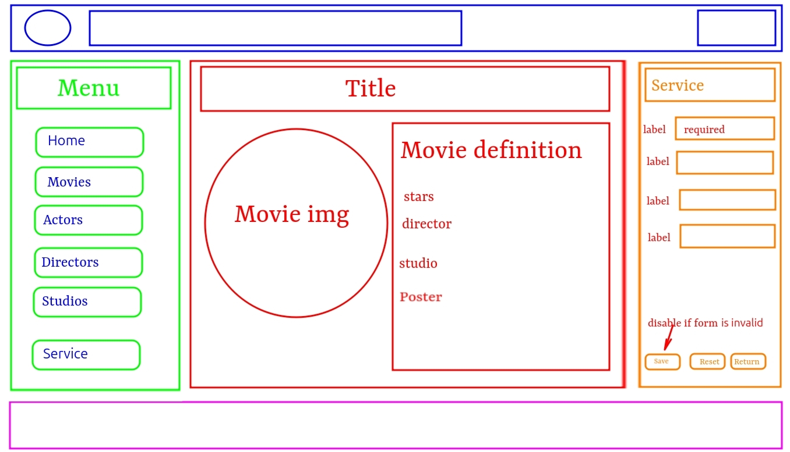
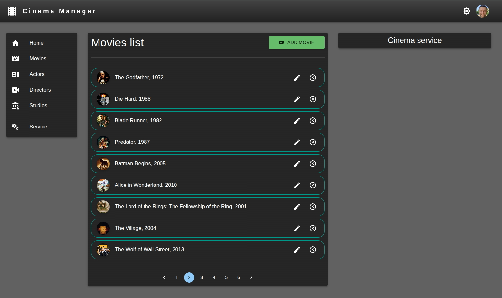
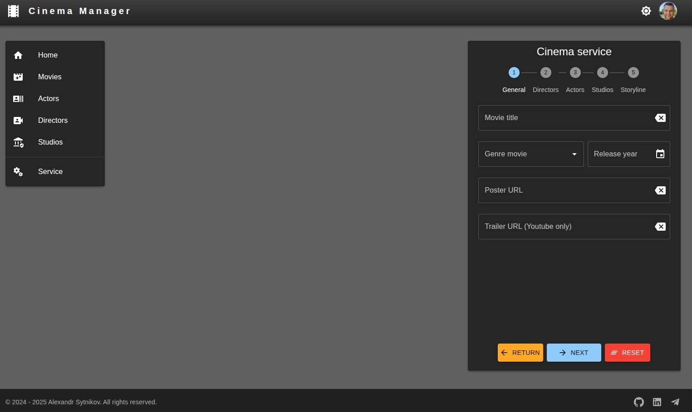

[mobile-menu] notes, contacts, (todo,) passwords, (calendar), account-settings[theme, lang, password]

<picture style="display: block; margin: 10px 0px; width: 643px; height: auto;">
    
</picture>
<div class="course-public-units-wrapper">
    <div class="shadow-container hide-border-right-radius" id="unit-1436578" style="margin-top: 20px; max-width: 100%;">
        <h4 class="course__content_summary__title bold">1. Описание</h4>
        <div>
            <article class="text-view">
                <p style="text-align: left;">1.1 Это проект, который реализует возможность создания, получения,
                    изменения, удаления и хранения информации для фильмов,&nbsp;актеров, и киностудий.</p>
                <p style="text-align: left;"></p>
                <p style="text-align: left;">1.2 Проект позволяет просматривать информацию о сюжете фильма,&nbsp;год
                    выпуска, список актеров, режиссеров, жанр, студия и прочее.&nbsp;</p>
                <p style="text-align: left;">Список актеров, режиссеров, студий позволяет по клику перейти на страницу с
                    информацией о конкретном актере, режиссере, студии и&nbsp;так далее.</p>
                <p style="text-align: left;"></p>
                <p style="text-align: left;">1.3* (ЗАДАНИЕ ПОВЫШЕННОЙ СЛОЖНОСТИ) Должна быть&nbsp;возможность просмотра
                    фрагмента фильма (лучше всего&nbsp;трейлера) в отдельной странице.</p>
            </article>
        </div> <!----></div> <!----> <!----> <!----> <!----> <!----> <!---->
    <div class="shadow-container hide-border-right-radius" id="unit-1436579" style="margin-top: 20px; max-width: 100%;">
        <h4 class="course__content_summary__title bold">2. Техническое задание</h4>
        <div>
            <article class="text-view"><p style="text-align: left;">2.1 Главная страница должна содержать:</p>
                <p style="text-align: left;">- header</p>
                <p style="text-align: left;">- footer</p>
                <p style="text-align: left;">- navigation (слева)</p>
                <p style="text-align: left;">- main (по центру)</p>
                <p style="text-align: left;">- service (справа)</p>
                <p style="text-align: left;"></p>
                <p style="text-align: left;"><span style="width: 577px; display: inline-block;"><picture
                        data-justify="flex-start" data-enlargable="Натисніть щоб збільшити"
                        style="display: block; margin: 10px 0px; width: 577px; height: auto;"></picture></span></p>
                <p style="text-align: left;">2.2 В header содержится информация о приложении: логотип,&nbsp;название,
                    выбор языка, выбор темы, авторизация (опционально) и&nbsp;прочее.</p>
                <p style="text-align: left;">2.3 В footer содержится информация об авторе приложения, support и&nbsp;прочее.</p>
                <p style="text-align: left;">2.4 В меню (navigation) ссылки на отдельные страницы для сущностей
                    приложения (фильмов, актеров, режиссеров и киностудий). А также переход на главную страницу и
                    страницу со служебными данными (жанры, локации, страны и прочее)</p>
                <p style="text-align: left;">2.5 В центре страницы (main) будет появляться основная информация&nbsp;о
                    той или иной сущности или список этих сущностей. Поскольку сущностей может быть довольно много,
                    необходимо&nbsp;будет организовать пагинацию.</p>
                <p style="text-align: left;"></p>
                <p style="text-align: left;"><span style="width: 643px; display: inline-block;"><picture
                        data-justify="flex-start" data-enlargable="Натисніть щоб збільшити"
                        style="display: block; margin: 10px 0px; width: 643px; height: auto;"></picture></span></p>
                <p style="text-align: left;">2.6 Будет большим плюсом, если будет адаптивность верстки и&nbsp;приложение
                    будет хорошо смотреться как на экране монитора, так&nbsp;и на мобильном устройстве.</p>
                <p style="text-align: left;">2.7 В сервисной части (справа) будут размещаться необходимые&nbsp;формы для
                    управления различными сущностями или служебными&nbsp;данными. Данные в форме должны валидироваться
                    на стороне&nbsp;клиента.</p>
                <p style="text-align: left;"></p>
                <p style="text-align: left;"><span style="width: 643px; display: inline-block;"><picture
                        data-justify="flex-start" data-enlargable="Натисніть щоб збільшити"
                        style="display: block; margin: 10px 0px; width: 643px; height: auto;"></picture></span></p>
                <p style="text-align: left;">2.8* (ЗАДАНИЕ ПОВЫШЕННОЙ СЛОЖНОСТИ) Нужно реализовать темную тему для
                    приложения.</p>
                <p style="text-align: left;">2.9 Хранение данных будет осуществляться при помощи СУБД&nbsp;PostgreSQL.
                    До того, как будет изучена эта СУБД, хранить и&nbsp;управлять данными можно при помощи пакета
                    json-server.</p>
                <p style="text-align: left;">2.10 Должна быть реализована полная функциональность серверной&nbsp;приложения
                    с контроллерами, маршрутизацией, валидацией на&nbsp;стороне сервера, обработкой ошибок, добавлением
                    файлов&nbsp;изображений и прочее.&nbsp;Эта часть проекта будет реализовываться по мере изучения&nbsp;материала.</p>
                <p style="text-align: left;">2.11* &nbsp;(ЗАДАНИЕ ПОВЫШЕННОЙ СЛОЖНОСТИ) Приложение должно запускаться в
                    контейнерах Docker.</p>
                <p style="text-align: left;">2.12* (ЗАДАНИЕ ПОВЫШЕННОЙ СЛОЖНОСТИ) Необходимо&nbsp;организовать
                    авторизацию с JWT.</p>
                <p style="text-align: left;">2.13* (ЗАДАНИЕ ПОВЫШЕННОЙ СЛОЖНОСТИ) Покрыть функциональность приложения
                    тестами.</p>
            </article>
        </div>
    </div>
    <div class="shadow-container hide-border-right-radius" id="unit-1436581" style="margin-top: 20px; max-width: 100%;">
        <h4 class="course__content_summary__title bold">3. Библиотеки и фреймворки</h4>
        <div>
            <article class="text-view">
                <p style="text-align: left;">Проект можно начинать выполнять после изучения тем&nbsp;React-Router,
                    Formik и MUI.
                    <br>
                    <br>3.1 Клиентская часть:</p>
                <p style="text-align: left;">- React, React DOM, React Router</p>
                <p style="text-align: left;">- Redux, Redux ToolKit</p>
                <p style="text-align: left;">- Axios</p>
                <p style="text-align: left;">- Formik</p>
                <p style="text-align: left;">- Yup</p>
                <p style="text-align: left;">- Material UI и прочее</p>
                <p style="text-align: left;">* - react-player — для просмотра видео</p>
                <p style="text-align: left;"></p>
                <p style="text-align: left;">3.2 Серверная часть:</p>
                <p style="text-align: left;">- Express</p>
                <p style="text-align: left;">- PostgreSQL, Sequelize, pg, pg-hstore</p>
                <p style="text-align: left;">- dotenv</p>
                <p style="text-align: left;">- cors</p>
                <p style="text-align: left;">- yup</p>
                <p style="text-align: left;">- multer</p>
                <p style="text-align: left;">* - Docker</p>
                <p style="text-align: left;">* - Mocha or Jest</p>
                <p style="text-align: left;">* - JWT</p>
            </article>
        </div>
    </div>
</div>
<nav>
    <a href="https://freshcode-training.kwiga.com/courses/javascript-developer-ru/pet-project-2">Task</a>
    <a href="https://reactrouter.com/start/declarative/installation">React Router</a>
    <a href="https://mui.com/material-ui/getting-started/installation/">MUI</a>
    <a href="https://react.i18next.com/">react-i18next</a>
    <a href="https://share.google/aimode/NfZwJ7DwSc8LegACR">react-i18next usage (by AI)</a>
</nav>
<h2>project creation</h2>

```
================
MaiNoteS
================

npm create vite@latest 5_5-MaiNoteS-stage1 -- --template react
cd 5_5-MaiNoteS-stage1
  https://github.com/new
  5_5-mainotes-stage1
git init
git remote add origin https://github.com/kdidovych/5_5-mainotes-stage1.git
  update ReadMe.md
npm i json-server axios redux react-redux redux-logger redux-toolkit react-router formik yup
npm install i18next react-i18next 
npm install i18next-http-backend
  maybe tese as well if needed: i18next-browser-languagedetector i18next-http-backend

  copy db.json and db-json-server-schema.json
npm install @mui/material @emotion/react @emotion/styled @mui/icons-material
npm install @fontsource/roboto
  in main.js
import '@fontsource/roboto/300.css';
import '@fontsource/roboto/400.css';
import '@fontsource/roboto/500.css';
import '@fontsource/roboto/700.css';

npm install -D vite-plugin-inspect @redux-devtools/extension
  replace favicon to public/favicon.png type="image/png" in index.js
  fix vulnerable packages lodash package.json
"overrides": {
  "lodash": "^4.17.21"
}

    vite-config.js
import Inspect from 'vite-plugin-inspect'
export default defineConfig({
plugins: [react(), Inspect()],
server: {
port: 3000,
},
});

    package.json
"scripts": {
"dev": "npm run json-server & vite",
"json-server": "npx json-server --watch db.json --port 5000",
"json-server-stop": "npx kill-port 5000",

npm install
npm run dev

=====================
      Заметки
=====================

заметки
круд (параметри, вложености, теги)
лист - категории
поиск
недавние
стики

туду
напоминалки/календарь

код-пен аналог для тестирования js (в отдельном контейнере)

=====================
      Медиа
=====================

переделать под реакт
контроллери, база, календарь, люди, дни рождения 
```